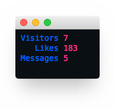

view your [okcupid][okcupidURL] stats from the command line

* **Organization** [Karbon Industries][companyURL]
* **Author** [Shammel Lee][authorURL]
* **Start Date** Sat Aug 2 17:53:37 EDT 2014

# Dependencies
* awk (available on most unix-based machines, run `$ which awk` to test if awk is available)
* [curl][curlURL]

# Building okcli
	$ make

# Setting up okcli

## Setting environment variables
	$ export OKCLI_USER=<username>
	$ export OKCLI_PASS=<password>
	$ export OKCLI_PATH=<okcliPath> # absolute path excluding trailing forward slash

	# example
	$ export OKCLI_USER=okcli_user
	$ export OKCLI_PASS=volcano123
	$ export OKCLI_PATH=/Users/magneto/bin/okcli # okcli is the directory that contains the ok, okclogin, and okcstats files

### Adding okcli to `$PATH` (optional but recommended)
	add okcli's path to your PATH environment variable.
	this allows running okcli without having to specify
	okcli's path every time it is run

	this should have the same value as
	the OKCLI_PATH environment variable

	$ export PATH=$PATH:$OKCLI_PATH

# Running okcli
	$ ok

[companyURL]: http://karbonindustri.es
[authorURL]: https://github.com/shammellee
[okcupidURL]: https://okcupid.com
[curlURL]: http://curl.haxx.se

